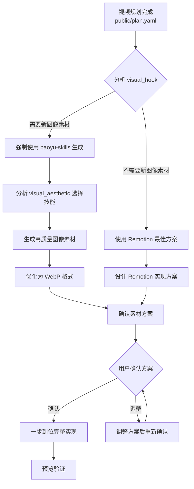

# Remotion 视频制作指南

## skills & MCP

Remotion 视频制作过程中使用以下技能和 MCP（模型上下文协议）工具，每个工具都有特定的用途和使用时机：

### 核心技能框架

#### 1. video-director-production-framework
**用途**: 视频导演生产框架，将文案或主题转换为结构化的视频规划数据
**输入**: 文案文件（如 `docs/跳跳糖.md`）或视频主题描述
**输出**: `public/plan.yaml`（包含完整的视频规划）
**使用时机**: 
- 视频制作开始前
- 需要将概念文案转化为可执行的视频规划
- 需要生成包含视觉设计、音频设计、场景规划的完整方案
**关键输出**: `visual_hook`（视觉钩子）、`audio_design`（音频设计）、`scene_structure`（场景结构）

#### 2. minimax-mcp
**用途**: AI 音频生成工具，生成场景音频
**输入**: 场景文本内容（来自 `public/plan.yaml` 中的 `key_dialogue`）
**输出**: `public/scene1.mp3`、`public/scene2.mp3` 等音频文件
**参数要求**:
- `speed=1.0`（统一语速）
- `emotion=neutral`（统一情感基调，遵循 `public/plan.yaml` 的 `technical_requirements`）
- `language_boost=Chinese`（中文优化）
**质量验证**:
- 语速: 3.5-4.1 字/秒
- 时长偏差: < 10%
- 语调一致性: 所有场景使用相同 `emotion` 参数
**使用时机**: 视频规划完成后，开发开始前

#### 3. remotion-best-practices
**用途**: Remotion 视频制作最佳实践指导
**内容**: 包含 30+ 个规则文件（动画、音频、图表、过渡等）
**使用时机**: 
- 开发前：了解 Remotion 核心概念和技术限制
- 开发中：解决具体技术问题（如 3D、粒子系统、音频同步）
- 优化时：性能优化和最佳实践应用
**关键文件**:
- `rules/animations.md`: 基础动画规则
- `rules/transitions.md`: 场景过渡模式
- `rules/audio.md`: 音频使用指南
- `rules/3d.md`: Three.js 集成指南

### 视觉素材生成技能

#### 4. baoyu-skills（视觉素材生成套件）
**用途**: 生成插画、信息图、漫画、封面图等视觉素材
**输入**: 内容描述或现有内容文件
**输出**: 图像文件（PNG、JPG、WebP）
**核心技能**:
- `baoyu-article-illustrator`: 智能文章插图生成器
- `baoyu-cover-image`: 封面图生成器
- `baoyu-comic`: 知识漫画创作器
- `baoyu-infographic`: 专业信息图生成器
- `baoyu-xhs-images`: 小红书风格信息图生成器
- `baoyu-slide-deck`: 幻灯片图片生成器

**后端依赖**: 使用时需使用 `baoyu-danger-gemini-web` 作为图像生成后端

---

## 🚀 AI Coding 实现原则（强制遵守）

> **优先级说明**：本节规则覆盖项目中的所有其他开发文档（包括 remotion-coding-guide.md）。当规则冲突时，以本节规则为准。

### 核心原则（不要弱智思考）

1. **不考虑技术能力约束**：
   - 这里是 AI Coding，大模型能力远超人类
   - 所有技术需求（粒子系统、Three.js、Lottie、Canvas）直接实现，不评估"会不会"
   - 技术上没有"学习曲线"，只有"立即执行"

2. **不考虑时间约束**：
   - 那不是 AI 该考虑的问题
   - 质量优先于速度，一步到位实现所有视觉要求
   - 不要因为"时间紧张"而简化任何功能

3. **素材问题已解决**：
   - 只要需要新图像素材，立即使用 baoyu-skills 生成
   - 不要"担忧"素材获取，直接干
   - 风格匹配按 `visual_aesthetic` 自动选择最佳 baoyu-skill

4. **一步到位完整实现**：
   - 严格按照 `public/plan.yaml` 的 `visual_hook` 要求实现
   - 不允许"简化实现"、"替代实现"、"延后实现"
   - 所有功能必须完整、高质量、符合原设计

5. **开发确认机制**：
   - 在开发设计方案完成后，只需要确认一次
   - 如果方案中包含 baoyu-skills 生成素材，提前说明
   - 如果不需要 baoyu-skills，采用 Remotion 最佳方案直接干

### 强制决策流程



### baoyu-skills 强制使用规则

#### 必须使用 baoyu-skills 的情况（立即执行）：
🔥 **任何需要特定风格插画的情况**：
- 复杂的场景插图（工厂流水线、口腔内部、共鸣腔等）
- 角色/物品的详细插图（跳跳糖颗粒特写等）
- 信息图/数据可视化（需要专业设计的图表）
- 封面图/标题图（需要视觉吸引力的设计）

#### baoyu-skills 风格匹配指南：
| visual_aesthetic | 强制使用的 baoyu-skill | 强制风格选择 |
|------------------|------------------------|--------------|
| `illustrative with tech elements` | `baoyu-article-illustrator` | `tech`, `editorial`, `blueprint` |
| `scientific visualization` | `baoyu-infographic` | `technical-schematic`, `scientific` |
| `playful cartoon` | `baoyu-comic` | `vibrant`, `playful`, `classic` |
| `professional corporate` | `baoyu-slide-deck` | `corporate`, `notion`, `bold-editorial` |
| `educational tutorial` | `baoyu-article-illustrator` | `chalkboard`, `sketch-notes`, `warm` |
| `magazine editorial` | `baoyu-infographic` | `editorial-infographic`, `bold-graphic` |

#### 图像生成工作流程（强制执行）：
1. **内容分析**：分析 `visual_hook` 描述，确定需要生成的图像内容
2. **技能选择**：根据上表强制选择 baoyu-skill 和风格
3. **立即生成**：使用相应技能生成高质量图像，不"担忧"素材问题
4. **图像优化**：使用 `baoyu-compress-image` 优化为 WebP 格式
5. **集成使用**：将图像放入 `public/images/` 目录，在 Remotion 中直接使用

### Remotion 能力使用规则（不自我设限）

#### 必须使用的高级能力：
✅ **Canvas 粒子系统**：当需要静电粒子、气泡爆炸、烟雾效果时
✅ **Three.js 3D**：当需要 3D 模型（口腔共鸣腔、糖粒结构）时  
✅ **Lottie 动画**：当需要复杂交互动画时
✅ **SVG 动画**：当需要精确的路径动画时
✅ **复杂的 interpolate 组合**：当需要多层动画效果时

#### 禁止的弱智思考：
❌ "这个技术我不会" → 不存在，直接实现
❌ "这个太复杂，简化一下吧" → 不允许简化
❌ "时间可能不够" → 不是 AI 该考虑的问题
❌ "素材可能不好获取" → 已解决，用 baoyu-skills

### 开发确认流程

#### 第1步：方案设计
- 基于 `public/plan.yaml` 设计完整的实现方案
- 列出所有需要的 baoyu-skills 图像素材
- 列出所有需要的 Remotion 高级功能
- 创建详细的实现计划

#### 第2步：用户确认
```markdown
## 开发方案确认

**视频项目**：[项目名称]
**方案包含**：
- baoyu-skills 生成图像：[列出具体图像]
- Remotion 高级功能：[列出具体功能]
- 预计实现效果：[描述最终效果]

**需要确认**：
- [ ] 同意使用 baoyu-skills 生成上述图像素材
- [ ] 确认 Remotion 实现方案
- [ ] 确认后立即开始一步到位实现
```

#### 第3步：执行与验证
- 用户确认后，立即开始实现
- 所有功能一步到位，不分阶段
- 完成后运行完整验证

### 快速参考命令（强制完整版）

```bash
# 1. 视频规划（强制完整）
[使用 video-director-production-framework skill，生成详细规划]

# 2. 音频生成（强制完整）
MiniMax-mcp_text_to_audio(
  text="场景文本",
  voice_id="female-shaonv", 
  emotion="neutral",
  speed=1.0,
  language_boost="Chinese"
)

# 3. 图像生成（强制使用 baoyu-skills）
# 生成插画（必须使用，不要犹豫）
baoyu-article-illustrator content.md --style tech
# 生成信息图（必须使用，不要犹豫）  
baoyu-infographic content.md --layout funnel --style technical-schematic
# 生成漫画（必须使用，不要犹豫）
baoyu-comic content.md --style classic --layout standard

# 4. 图像优化（必须执行）
baoyu-compress-image generated-image.png --quality 85

# 5. Remotion 开发（一步到位）
pnpm run dev  # 预览验证所有高级功能
pnpm run render  # 渲染完整视频
```

---

**注意**：baoyu-skills 的详细使用方法和可用选项，请参考 [baoyu-skills.md](baoyu-skills.md) 文档。**不要弱智思考，直接干**。

## 视频制作流程

### 第 1 步：视频规划
使用 `video-director-production-framework` skill 转换文案为 `public/plan.yaml`。

**审核要点**:
- 画面设计指导明确
- 音频设计指导包含倍率信息  
- 视频结构清晰
- 时长规划合理

### 第 2 步：开发方案确认（新增强制步骤）
**目的**：基于 `public/plan.yaml` 设计完整实现方案，向用户确认后立即执行。

**确认内容**：
1. **图像素材需求分析**：
   - 分析 `visual_hook` 描述，列出需要生成的图像素材
   - 根据 `visual_aesthetic` 选择相应的 baoyu-skill
   - 说明图像规格（分辨率、风格、数量）

2. **Remotion 技术方案**：
   - 分析 `visual_hook` 的技术需求（粒子系统、3D、Lottie、Canvas等）
   - 列出需要使用的 Remotion 高级功能
   - 说明动画策略和过渡效果

3. **提交用户确认**：
   ```markdown
   ## 开发方案确认
   
   **视频项目**：[项目名称]
   **方案包含**：
   - baoyu-skills 生成图像：[列出具体图像]
   - Remotion 高级功能：[列出具体功能]
   - 预计实现效果：[描述最终效果]
   
   **需要确认**：
   - [ ] 同意使用 baoyu-skills 生成上述图像素材
   - [ ] 确认 Remotion 实现方案
   - [ ] 确认后立即开始一步到位实现
   ```

**确认后流程**：
- 用户确认 → 立即开始生成音频 + 图像素材 + Remotion开发
- 用户调整 → 调整方案后重新确认
- **绝对不允许**在确认前开始开发

### 第 3 步：音频生成
使用 minimax-mcp 工具生成场景音频：
- **位置**: `public/` 目录
- **语速**: speed=1.0（统一）
- **参数**: emotion=neutral, language_boost=Chinese
- **验证**: 语速 3.5-4.1 字/秒，时长偏差 < 10%

### 第 4 步：视频开发 -use remotion-best-practices skill
1. 基于 `public/plan.yaml` 创建场景组件
2. 配置 `MainVideo.tsx` 组合场景与音频
3. 配置 `Root.tsx` 定义 Composition


### 第 5 步：预览验证
```bash
pnpm run dev
```

**检查**:
- 所有场景音频正常播放
- 场景切换与音频节奏匹配
- 视觉效果符合预期
- 最后一个场景音频完整播放

### 代码审查规则

在开发场景组件时，必须遵守 **[remotion-coding-guide.md](remotion-coding-guide.md)** 中的 Remotion 编码规范。

**开发前指导：**
- ✅ 复制标准组件模板开始开发
- ✅ 了解 useCurrentFrame() 返回全局帧数的机制
- ✅ 遵循预防性规则，避免常见陷阱

**常见问题：**
- useCurrentFrame() 返回全局帧数，导致多场景视频中后继场景不可见
- interpolate 计算超出范围，导致 opacity=0
- map 循环中的 interpolate 使用全局帧数

**审查流程：**
1. **开发前**：阅读 remotion-coding-guide.md 的"开发前指导"部分
2. **开发时**：参考"核心规则"和"常见陷阱"
3. **完成后**：运行检查清单，确保所有规则通过
4. **更新文档**：发现新问题时，按照"自更新机制"更新文档

**关键规则：**
- Sequence 内部必须使用 `const relativeFrame = frame - from;` 计算相对帧数
- 所有 interpolate 调用第一个参数必须是 relativeFrame
- map/forEach 循环中的 interpolate 也必须使用 relativeFrame
- interpolate 的输入范围必须在 [0, duration] 内

### 第 6 步：渲染输出
```bash
pnpm run render
```

**输出**: `output/video.mp4`

**验证**:
- 视频时长 = 音频总时长（误差 ≤ 0.1 秒）
- 分辨率: 1920x1080
- 帧率: 30fps

## 设计令牌

优先使用 `src/utils/visual-design.ts` 定义：
- `COLORS`: 颜色系统
- `TYPOGRAPHY`: 字体系统  
- `LAYOUT`: 布局参数
- `ANIMATION`: 动画参数

遵循 `public/plan.yaml` 中的 `visual_design_guide`，冲突时需确认。

## 一句话创建视频
```
基于 "docs/跳跳糖.md" 创建一个 60 秒科普视频
```
