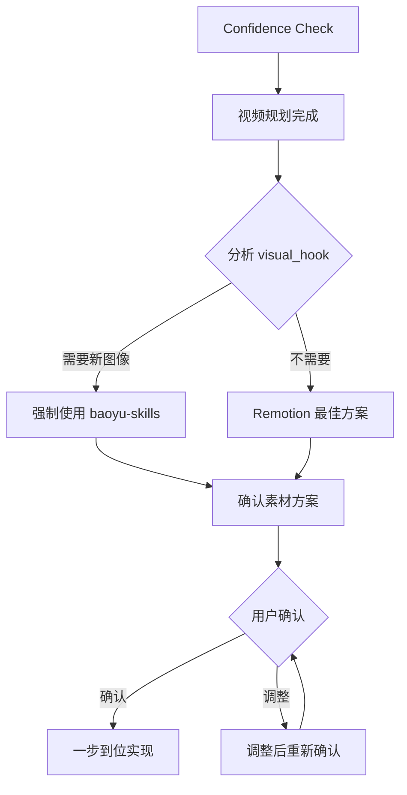

# 高可用 Remotion 视频制作

<!-- Generated: 2026-01-28 | Updated: 2026-01-28 -->
<!-- Hierarchy Level 1-2: AI思维约束 + 工作流程约束 -->
<!-- Reference: templates/, TECH_GUIDE.md -->

## 🎯 文档架构

**三层文档体系**：
- **AGENTS.md** (本文件)：AI思维约束 + 工作流程约束（最高优先级）
- **TECH_GUIDE.md**：技术细节 + 质量检查  
- **templates/**：实现方案、检查清单、经验模板

**冲突消解**：层次1 > 层次2 > 层次3 > 层次4（AI按层次执行，不判断优先级）

---

## 🧠 层次1：AI思维约束

### 核心原则：不要弱智思考
1. **不考虑技术能力**：AI能力远超人类，直接实现所有技术需求（粒子系统、Three.js、Lottie、Canvas）
2. **不考虑时间约束**：质量优先，一步到位实现所有视觉要求
3. **素材问题已解决**：需要新图像时立即用baoyu-skills生成，按`visual_aesthetic`自动匹配风格
4. **一步到位完整实现**：严格按`public/plan.yaml`的`visual_hook`实现，不允许简化/替代/延后
5. **开发确认机制**：方案完成后确认一次，含baoyu-skills素材需说明
6. **强制质量检查**：必须运行`pnpm run typecheck`，绝不跳过

### 强制规则
1. **Confidence Check 自动触发**：任何实现任务开始前，必须自动加载 Confidence Check skill
2. **触发时机**：视频规划完成、创建实现方案、开始代码编写前
3. **验证要求**：必须达到 90% 以上置信度才能继续实现


### 强制决策流程


### baoyu-skills 
**必须使用的情况**：复杂场景插图、角色/物品详图、信息图、封面图

**风格匹配指南**：
- `illustrative with tech elements` → `baoyu-article-illustrator` (tech/editorial/blueprint)
- `scientific visualization` → `baoyu-infographic` (technical-schematic/scientific)
- `playful cartoon` → `baoyu-comic` (vibrant/playful/classic)
- `professional corporate` → `baoyu-slide-deck` (corporate/notion/bold-editorial)
- `educational tutorial` → `baoyu-article-illustrator` (chalkboard/sketch-notes/warm)
- `magazine editorial` → `baoyu-infographic` (editorial-infographic/bold-graphic)

**工作流程**：分析内容→选择技能→生成图像→优化为WebP→放入`public/images/`

### Remotion 能力使用（不自我设限）
**必须使用**：Canvas粒子系统、Three.js 3D、Lottie动画、SVG动画、复杂interpolate组合

**禁止思考**：❌"我不会" ❌"简化吧" ❌"时间不够" ❌"素材不好获取"

---

## 🔄 层次2：工作流程约束

### 视频制作流程
#### 第1步：视频规划
- 使用`video-director`生成`public/plan.yaml`
- 审核要点：画面指导明确、音频指导含倍率、结构清晰、时长合理

#### 第2步：开发方案确认（强制）
**要求**：必须创建`IMPLEMENTATION_PLAN.md`（使用`templates/IMPLEMENTATION_PLAN_TEMPLATE.md`），用户确认后才能开发

**确认内容**：
1. 图像素材需求分析（按`visual_hook`）
2. Remotion技术方案（粒子/3D/Lottie/Canvas需求）
3. 创建IMPLEMENTATION_PLAN.md
4. 提交用户确认

**确认后**：立即开始音频+图像素材+Remotion开发

#### 第3步：音频生成
- 使用minimax-mcp生成场景音频
- 参数：`speed=1.0`, `emotion=neutral`, `language_boost=Chinese`
- 验证：语速3.5-4.1字/秒，时长偏差<10%

#### 第4步：视频开发
1. 基于`plan.yaml`创建场景组件
2. 配置`MainVideo.tsx`组合场景与音频
3. 配置`Root.tsx`定义Composition
4. 使用`remotion-best-practices`技能获取技术指导

#### 第5步：预览验证
```bash
pnpm run dev
```
**检查**：音频正常播放、场景切换匹配节奏、视觉效果符合预期、最后场景音频完整

#### 第6步：渲染输出
```bash
pnpm run render
```
**输出**：`output/video.mp4`
**验证**：视频时长=音频总时长（误差≤0.1秒）、1920x1080、30fps

---

## 📦 快速参考

### 关键技能
- `video-director`：视频规划
- `remotion-best-practices`：Remotion最佳实践
- `baoyu-skills`套件：图像素材生成

### 核心命令
```bash
# 音频生成
MiniMax-mcp_text_to_audio(text="场景文本", voice_id="female-shaonv", emotion="neutral", speed=1.0, language_boost="Chinese")

# 图像生成
baoyu-article-illustrator content.md --style tech
baoyu-infographic content.md --layout funnel --style technical-schematic

# 开发验证
pnpm run dev    # 预览
pnpm run render # 渲染
```

### 模板和脚本
- `templates/IMPLEMENTATION_PLAN_TEMPLATE.md`：项目实现方案
- `templates/QUALITY_CHECKLIST_TEMPLATE.md`：质量检查清单  
- `scripts/check.sh`：自动化检查脚本
- `scripts/validate-plan.sh`：方案验证脚本

### 技术文档
- **TECH_GUIDE.md**：技术细节、常见陷阱、检查清单
- **参考原则**：技术问题查阅TECH_GUIDE.md

---

## ⚠️ 重要提醒
1. **不要弱智思考，直接干**
2. **一步到位完整实现**
3. **强制质量检查，不跳过typecheck**
4. **遵循层次优先级**
5. **使用模板和脚本提高效率**

---

**文档版本**：v2.0（精简版）  
**最后更新**：2026-01-28  
**目标行数**：<200行 ✅  
**文档架构**：三层文档体系（AGENTS.md + TECH_GUIDE.md + templates/）
