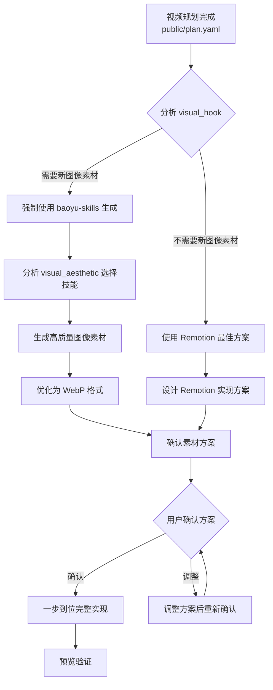

# Remotion 开发指南

> **重要提示**：本指南是 Remotion 项目的**技术实现指南**。对于开发流程、决策逻辑和强制规则，请优先遵循 **[AGENTS.md](AGENTS.md)** 文档。当规则冲突时，以 AGENTS.md 为准。
>
> 本指南聚焦于技术实现细节，包括核心规则、常见陷阱和检查清单。开发流程部分已根据 AGENTS.md 进行了简化和对齐。

## 📋 文档关系说明

### 本指南与 AGENTS.md 的关系
- **AGENTS.md**：主工作流程文档，包含强制决策流程、AI Coding 原则、技能使用规则
- **本指南**：技术实现参考，包含 Remotion 特定技术规则、最佳实践、检查清单

### 核心引用原则
1. **优先级原则**：AGENTS.md 的规则覆盖本指南，冲突时以 AGENTS.md 为准
2. **流程引用原则**：开发流程、方案选择、确认机制请直接遵循 AGENTS.md
3. **技术聚焦原则**：本指南专注技术实现细节（相对帧数、interpolate、动画等）

---

## 🚀 开发前指导（Before You Start）

### 快速开始模板
- 遵循`remotion-best-practices` skill 最佳实践

### 预防性规则（Preventive Rules）

**❌ 不要这样做：**

```tsx
export const BadScene: React.FC<SceneProps> = ({ from, duration }) => {
  const frame = useCurrentFrame();
  
  // ❌ 使用全局帧数进行 interpolate
  const opacity = interpolate(frame, [0, 10, duration - 10, duration], [0, 1, 1, 0]);
  
  return (
    <Sequence from={from} durationInFrames={duration}>
      {/* ❌ 在 map 循环中使用全局帧数 */}
      {[0, 1, 2].map((i) => {
        const scale = interpolate(frame, [30 + i * 10, 60 + i * 10], [0, 1]);
        return <div key={i} style={{ transform: `scale(${scale})` }} />;
      })}
    </Sequence>
  );
};
```

**✅ 应该这样做：**

```tsx
export const GoodScene: React.FC<SceneProps> = ({ from, duration }) => {
  const frame = useCurrentFrame();
  const relativeFrame = frame - from;  // ✅ 立即计算相对帧数
  
  // ✅ 使用相对帧数进行 interpolate
  const opacity = interpolate(relativeFrame, [0, 10, duration - 10, duration], [0, 1, 1, 0]);
  
  return (
    <Sequence from={from} durationInFrames={duration}>
      {/* ✅ 在 map 循环中使用相对帧数 */}
      {[0, 1, 2].map((i) => {
        const scale = interpolate(relativeFrame, [30 + i * 10, 60 + i * 10], [0, 1]);
        return <div key={i} style={{ transform: `scale(${scale})` }} />;
      })}
    </Sequence>
  );
};
```

### 开发前检查清单（Pre-Development Checklist）

在开始编写代码前，逐项确认：

- [ ] **理解了 useCurrentFrame() 的返回值**
  - [ ] 知道它返回的是全局帧数（从视频开始算）
  - [ ] 理解需要计算相对帧数：`relativeFrame = frame - from`
  
- [ ] **准备了标准模板**
  - [ ] 复制了上面的标准组件模板
  - [ ] 修改了组件名称和接口
  
- [ ] **规划了动画逻辑**
  - [ ] 明确了 interpolate 的输入范围（通常 [0, duration]）
  - [ ] 明确了 interpolate 的输出范围（通常 [0, 1] 或其他）
  
- [ ] **检查了音频文件**
  - [ ] 音频文件已放在 `public/` 目录
  - [ ] 音频文件名与代码中引用一致

---

## 🔄 开发流程（基于 AGENTS.md）

> **重要提示**：完整的开发流程、决策逻辑和强制规则请遵循 **[AGENTS.md](AGENTS.md)**。本节提供简化的技术实现流程概述。

### 开发流程概述

根据 AGENTS.md 的强制决策流程，Remotion 视频开发遵循以下简单流程：



### AI Coding 实现原则（引用 AGENTS.md）

> **核心原则：不要弱智思考**

1. **不考虑技术能力约束**：
   - 这里是 AI Coding，大模型能力远超人类
   - 所有技术需求（粒子系统、Three.js、Lottie、Canvas）直接实现，不评估"会不会"
   - 技术上没有"学习曲线"，只有"立即执行"

2. **不考虑时间约束**：
   - 那不是 AI 该考虑的问题
   - 质量优先于速度，一步到位实现所有视觉要求
   - 不要因为"时间紧张"而简化任何功能

3. **素材问题已解决**：
   - 只要需要新图像素材，立即使用 baoyu-skills 生成
   - 不要"担忧"素材获取，直接干
   - 风格匹配按 `visual_aesthetic` 自动选择最佳 baoyu-skill

4. **一步到位完整实现**：
   - 严格按照 `public/plan.yaml` 的 `visual_hook` 要求实现
   - 不允许"简化实现"、"替代实现"、"延后实现"
   - 所有功能必须完整、高质量、符合原设计

5. **开发确认机制**：
   - 在开发设计方案完成后，只需要确认一次
   - 如果方案中包含 baoyu-skills 生成素材，提前说明
   - 如果不需要 baoyu-skills，采用 Remotion 最佳方案直接干

### 两种方案选择

根据 AGENTS.md 的简化决策逻辑，只有两种实现方案：

#### 方案1：纯 Remotion 实现

**适用情况**：
- visual_hook 完全可以使用 Remotion 技术栈实现
- 不需要特定风格的插画、信息图或漫画
- 可以使用 CSS/SVG/Canvas/Three.js 等技术实现视觉效果

**实现方式**：
1. 使用 `remotion-best-practices` skill 评估技术可行性
2. 设计 Remotion 实现方案（动画、过渡、特效）
3. 直接使用 Remotion 技术栈实现
4. 不需要生成外部图像素材

**示例场景**：
- 简单的几何图形、图标动画
- 文字效果、渐变背景
- 粒子系统、数据可视化（使用 Canvas）
- 3D 模型展示（使用 Three.js）

#### 方案2：Remotion + baoyu-skills 生成图片

**适用情况**：
- visual_hook 需要特定风格的插画、信息图、漫画或封面图
- 复杂场景插图（工厂流水线、口腔内部、共鸣腔等）
- 角色/物品的详细插图（跳跳糖颗粒特写等）
- 信息图/数据可视化（需要专业设计的图表）
- 封面图/标题图（需要视觉吸引力的设计）

**实现方式**：
1. 分析 `visual_hook` 描述，确定需要生成的图像内容
2. 根据 `visual_aesthetic` 选择相应的 baoyu-skill
3. 使用 baoyu-skills 生成高质量图像素材
4. 使用 `baoyu-compress-image` 优化为 WebP 格式
5. 将图像放入 `public/images/` 目录
6. 在 Remotion 组件中使用生成的图像

**baoyu-skills 风格匹配指南**（引用 AGENTS.md）：

| visual_aesthetic | 强制使用的 baoyu-skill | 强制风格选择 |
|------------------|------------------------|--------------|
| `illustrative with tech elements` | `baoyu-article-illustrator` | `tech`, `editorial`, `blueprint` |
| `scientific visualization` | `baoyu-infographic` | `technical-schematic`, `scientific` |
| `playful cartoon` | `baoyu-comic` | `vibrant`, `playful`, `classic` |
| `professional corporate` | `baoyu-slide-deck` | `corporate`, `notion`, `bold-editorial` |
| `educational tutorial` | `baoyu-article-illustrator` | `chalkboard`, `sketch-notes`, `warm` |
| `magazine editorial` | `baoyu-infographic` | `editorial-infographic`, `bold-graphic` |

### 开发确认流程（引用 AGENTS.md）

#### 第1步：方案设计
- 基于 `public/plan.yaml` 设计完整的实现方案
- 列出所有需要的 baoyu-skills 图像素材（如适用）
- 列出所有需要的 Remotion 高级功能
- 创建详细的实现计划

#### 第2步：用户确认
```markdown
## 开发方案确认

**视频项目**：[项目名称]
**方案包含**：
- baoyu-skills 生成图像：[列出具体图像]
- Remotion 高级功能：[列出具体功能]
- 预计实现效果：[描述最终效果]

**需要确认**：
- [ ] 同意使用 baoyu-skills 生成上述图像素材
- [ ] 确认 Remotion 实现方案
- [ ] 确认后立即开始一步到位实现
```

#### 第3步：执行与验证
- 用户确认后，立即开始实现
- 所有功能一步到位，不分阶段
- 完成后运行完整验证

### 音频生成规则

音频生成遵循 AGENTS.md 中的规范：
- 使用 minimax-mcp 工具生成场景音频
- 位置：`public/` 目录
- 参数：`speed=1.0`, `emotion=neutral`, `language_boost=Chinese`
- 验证：语速 3.5-4.1 字/秒，时长偏差 < 10%

---

### 方案文档化

创建 `IMPLEMENTATION_PLAN.md` 文件，记录每个场景的实现方案。模板请参考 AGENTS.md 中的简化版本或使用以下基本结构：

```markdown
# Remotion 视频实现方案

## 项目信息
- **项目名称**: [项目名称]
- **规划文档**: public/plan.yaml
- **创建日期**: [日期]

## 方案总结
- **总场景数**: [数字]
- **使用 baoyu-skills**: [是/否，如是，列出具体图像]
- **Remotion 高级功能**: [列出具体功能]

## 场景实现方案
### Scene1: [场景名称]
- **方案**: [方案1或方案2]
- **baoyu-skills 图像**: [如适用]
- **Remotion 技术**: [技术细节]
- **动画策略**: [动画描述]

## 开发确认
- [ ] 方案已设计完成
- [ ] 用户已确认方案
- [ ] 准备开始一步到位实现
```


---

### 开发前检查清单（基于 AGENTS.md）

在开始编写代码前，逐项确认：

- [ ] **阅读了 AGENTS.md 的强制原则**
  - [ ] 理解了"不要弱智思考"原则
  - [ ] 理解了"一步到位完整实现"要求
  - [ ] 理解了 baoyu-skills 强制使用规则

- [ ] **分析了 visual_hook 需求**
  - [ ] 阅读了 public/plan.yaml 中的所有 visual_hook
  - [ ] 确定了每个 visual_hook 的实现方案（方案1或方案2）
  - [ ] 对于需要 baoyu-skills 的情况，已选择对应的技能和风格

- [ ] **准备了开发方案确认**
  - [ ] 已设计完整的实现方案
  - [ ] 已列出所有需要的 baoyu-skills 图像素材（如适用）
  - [ ] 已列出所有需要的 Remotion 高级功能
  - [ ] 准备向用户提交确认

- [ ] **理解了技术核心规则**
  - [ ] 理解了 useCurrentFrame() 返回全局帧数
  - [ ] 理解了需要计算相对帧数：`relativeFrame = frame - from`
  - [ ] 理解了 interpolate 的正确使用方法
  
- [ ] **准备了标准模板**
  - [ ] 复制了标准组件模板
  - [ ] 修改了组件名称和接口
  
- [ ] **规划了动画逻辑**
  - [ ] 明确了 interpolate 的输入范围（通常 [0, duration]）
  - [ ] 明确了 interpolate 的输出范围（通常 [0, 1] 或其他）
  
- [ ] **检查了音频文件**
  - [ ] 音频文件已使用 minimax-mcp 生成，放在 `public/` 目录
  - [ ] 音频参数符合规范：`speed=1.0`, `emotion=neutral`, `language_boost=Chinese`
  - [ ] 语速验证：3.5-4.1 字/秒，时长偏差 < 10%

- [ ] **技术准备完成**
  - [ ] 已加载 remotion-best-practices skill（如需要技术指导）
  - [ ] 开发工具和环境已准备

---

### 开发执行（基于 AGENTS.md）

按照 AGENTS.md 的强制原则执行开发：

#### 执行规则

1. **一步到位完整实现**
   - 严格按照 `public/plan.yaml` 的 `visual_hook` 要求实现
   - 不允许"简化实现"、"替代实现"、"延后实现"
   - 所有功能必须完整、高质量、符合原设计

2. **立即解决素材问题**
   - 需要新图像素材时，立即使用 baoyu-skills 生成
   - 不要"担忧"素材获取，直接干
   - 风格匹配按 `visual_aesthetic` 自动选择最佳 baoyu-skill

3. **不自我设限**
   - 不考虑技术能力约束（AI Coding 大模型能力远超人类）
   - 不考虑时间约束（质量优先于速度）
   - 直接实现所有技术需求（粒子系统、Three.js、Lottie、Canvas）

4. **保持方案文档同步**
   - 如果方案有调整，立即更新 IMPLEMENTATION_PLAN.md（如使用）
   - 如果遇到意料之外的问题，记录经验教训
   - 如果发现更好的实现方式，记录成功经验

5. **遵循技术核心规则**
   - 所有代码必须遵循本指南的"核心规则"
   - 使用 `relativeFrame` 计算
   - 所有 interpolate 的范围必须正确

6. **预览和调试**
   - 每完成一个场景，立即预览
   - 使用 `pnpm run dev` 验证动画效果
   - 修复所有可见问题后再继续

---

### 开发执行（Phase 4: Execution）

按照 `IMPLEMENTATION_PLAN.md` 执行，严格遵守以下规则：

#### 执行规则

1. **严格按照方案开发**
   - 不要随意简化或删除 `visual_hook`
   - 如果必须调整，先更新 `IMPLEMENTATION_PLAN.md`
   - 记录所有偏离原因

2. **简化或删除必须记录**
   - 如果简化了实现，添加 TODO 注释
   - 如果删除了实现，记录删除理由
   - 更新 `IMPLEMENTATION_PLAN.md` 中的"方案选择"部分

3. **保持方案文档同步**
   - 如果方案有调整，立即更新 `IMPLEMENTATION_PLAN.md`
   - 如果遇到意料之外的问题，记录到"经验教训"部分
   - 如果发现更好的实现方式，记录到"成功经验"部分

4. **遵循核心规则**
   - 所有代码必须遵循 `remotion-coding-guide.md` 的核心规则
   - 使用 `relativeFrame` 计算
   - 所有 interpolate 的范围必须正确

5. **预览和调试**
   - 每完成一个场景，立即预览
   - 使用 `pnpm run dev` 验证动画效果
   - 修复所有可见问题后再继续

---

### 质量检查（基于 AGENTS.md）

开发完成后，进行质量检查。根据 AGENTS.md 的"一步到位完整实现"原则，重点检查技术实现质量，而非方案对比。

#### 视觉质量检查

- [ ] **visual_hook 是否完整实现？**
  - [ ] 检查每个 visual_hook 是否按照 `public/plan.yaml` 的要求完整实现
  - [ ] 检查是否有未实现的 visual_hook
  - [ ] 检查实现质量是否符合预期

- [ ] **动画流畅度是否符合预期（30fps）？**
  - [ ] 运行 `pnpm run dev` 预览
  - [ ] 检查是否有卡顿或跳帧
  - [ ] 使用 Chrome DevTools Performance 工具检查帧率

- [ ] **场景过渡是否实现？**
  - [ ] 检查 Scene1→2 的过渡
  - [ ] 检查 Scene2→3 的过渡
  - [ ] 检查 Scene3→4 的过渡
  - [ ] 检查过渡效果是否符合 plan.yaml 中的 transition_logic

- [ ] **颜色、字体是否遵循 visual_design_guide？**
  - [ ] 检查主色调是否与 plan.yaml 中的 visual_design_guide 一致
  - [ ] 检查字体是否与 visual_design_guide 一致
  - [ ] 检查字号是否合适

- [ ] **情感基调是否与 plan.yaml 一致？**
  - [ ] Scene1: playful（活泼有趣）？
  - [ ] Scene2: professional（专业科学）？
  - [ ] Scene3: suspense（紧张震撼）？
  - [ ] Scene4: inspiring（启发认知）？

#### 技术质量检查

- [ ] **是否遵循 remotion-coding-guide.md 的核心规则？**
  - [ ] 检查所有场景是否使用 `relativeFrame`
  - [ ] 检查所有 interpolate 是否使用 `relativeFrame`
  - [ ] 检查 map 循环中的 interpolate 是否使用 `relativeFrame`
  - [ ] 检查 interpolate 的范围是否在 [0, duration] 内

- [ ] **代码是否可维护（有注释、结构清晰）？**
  - [ ] 检查是否有必要的注释
  - [ ] 检查代码结构是否清晰
  - [ ] 检查命名是否规范

- [ ] **音频同步是否正确？**
  - [ ] 检查所有场景的音频文件是否正确引用
  - [ ] 检查音频时长与场景时长是否匹配
  - [ ] 检查 `MainVideo.tsx` 中的 Sequence from/duration 是否正确
  - [ ] 检查 `Root.tsx` 中的 totalDuration 是否正确

- [ ] **baoyu-skills 图像使用是否正确？**
  - [ ] 检查生成的图像是否在 `public/images/` 目录
  - [ ] 检查图像格式是否为 WebP（已优化）
  - [ ] 检查图像引用路径是否正确
  - [ ] 检查图像风格是否符合 visual_aesthetic

#### 功能检查

- [ ] **所有场景都能正常预览？**
  - [ ] 运行 `pnpm run dev`
  - [ ] 检查所有场景是否都能显示
  - [ ] 检查所有动画是否正常播放

- [ ] **视频渲染是否成功？**
  - [ ] 运行 `pnpm run render`
  - [ ] 检查是否有错误
  - [ ] 检查输出文件是否生成

- [ ] **视频时长是否与音频一致？**
  - [ ] 使用 ffprobe 检查视频时长
  - [ ] 对比音频总时长
  - [ ] 误差应 < 0.1 秒

- [ ] **所有场景的音频都能正常播放？**
  - [ ] 播放 output/video.mp4
  - [ ] 检查所有场景的音频是否清晰
  - [ ] 检查音频与视频是否同步

- [ ] **音频参数是否符合规范？**
  - [ ] 检查所有音频的 emotion 参数是否为 neutral
  - [ ] 检查所有音频的 speed 参数是否为 1.0
  - [ ] 检查所有音频的 language_boost 参数是否为 Chinese
  - [ ] 检查语速是否为 3.5-4.1 字/秒

---

### 经验教训记录（Lessons Learned）

> **注意**：本节记录**技术实现**方面的经验教训。开发流程、决策逻辑和强制规则请遵循 [AGENTS.md](AGENTS.md)。

开发完成后，记录技术经验教训，持续改进技术实现。

#### 成功的经验

记录哪些技术方案效果很好，可以复用：

```markdown
#### 示例：使用 baoyu-skills 生成高质量插画 - 场景 2 的工厂流水线

**方案描述**: 根据 visual_hook 要求，使用 baoyu-article-illustrator 生成工厂流水线插画。

**为什么成功**:
- 生成的插画专业度高，符合 scientific visualization 风格
- 图像质量优秀（1024x1024, WebP 格式）
- 风格与 visual_aesthetic 完全匹配
- 节省了手动绘制的时间

**如何复用**:
- 对于需要特定风格插画的 visual_hook，优先使用 baoyu-skills
- 根据 visual_aesthetic 选择对应的 baoyu-skill 和风格
- 生成后使用 baoyu-compress-image 优化为 WebP 格式
- 适用于复杂的场景插图、信息图、漫画等
```

#### 失败的教训

记录哪些方案效果不好，如何避免：

```markdown
#### 示例：波纹动画实现错误 - 场景 4

**方案描述**: 原计划使用简单的竖条波纹模拟振动频谱，但实现时在 `transform: scaleY()` 中使用了 `Math.sin()` 表达式，导致波纹每帧都在剧烈抖动，而不是平滑变化。

**为什么失败**:
- `transform: scaleY()` 应该是一个固定值或 `interpolate` 的结果
- 使用 `Math.sin(relativeFrame * 0.1 + index)` 导致每帧都重新计算，产生抖动
- 没有在预览时发现问题，直到渲染视频才发现

**如何避免**:
- 波纹高度应该使用 `interpolate` 计算，而不是直接使用 `Math.sin()`
- 如果需要周期性变化，应该预先计算关键帧，然后用 `interpolate` 插值
- 必须在预览时仔细检查动画效果，不要直接渲染
- 对于复杂的动画，可以先在 CodePen 或 CodeSandbox 上测试

**正确的实现**:
```tsx
// ❌ 错误：每帧都重新计算，产生抖动
<div style={{ transform: `scaleY(${Math.sin(relativeFrame * 0.1 + index) * 0.5 + 1})` }} />

// ✅ 正确：使用 interpolate 平滑过渡
const waveHeight = interpolate(
  relativeFrame,
  [30, 180],
  [10, 50 + Math.sin(index) * 30],
  { extrapolateLeft: "clamp", extrapolateRight: "clamp" }
);
<div style={{ height: waveHeight }} />
```
```

#### 意料之外的问题

记录遇到了什么问题，如何解决：

```markdown
#### 示例：SVG 图标在 Remotion 中的性能问题

**问题描述**: 在 Scene2 中使用大量 SVG 图标（10+ 个气泡），导致预览和渲染时性能严重下降，卡顿明显。

**根本原因**:
- SVG 图标在 Remotion 中每帧都重新渲染
- 大量 SVG 图标导致 DOM 节点过多
- 没有使用 `React.memo` 优化

**预防措施**:
- 对于大量相似的元素，考虑使用 Remotion Canvas 绘制
- 使用 `React.memo` 优化组件渲染
- 限制 DOM 节点数量（建议 < 100 个）
- 使用 `will-change` 属性提示浏览器优化动画

**解决方案**:
1. 使用 Remotion Canvas 替代 SVG（性能提升 10x）
2. 使用 `React.memo` 包装组件（性能提升 2x）
3. 减少节点数量（从 20 个减少到 8 个）
```

#### 技术学习

记录学习了什么，后续如何应用：

```markdown
#### 示例：Remotion Canvas 粒子系统基础

**学习内容**:
- Remotion Canvas 的基本 API（`drawImage`, `fillRect`, `beginPath`, `arc` 等）
- 粒子系统的基本原理（位置、速度、加速度、生命周期）
- 性能优化技巧（使用 `requestAnimationFrame`、限制粒子数量）

**学习资源**:
- Remotion Canvas 官方文档: https://www.remotion.dev/docs/canvas
- 粒子系统教程: [链接]
- 示例代码: [链接]

**学习时间**: 8 小时

**后续如何应用**:
- 在 Scene1 中实现静电粒子特效
- 在 Scene3 中实现真实的气泡爆炸效果
- 在后续项目中，优先使用 Canvas 绘制大量相似元素
```

#### 素材获取

记录从哪里获取素材，质量如何：

```markdown
#### 示例：AI 生成插画 - DALL-E 3

**素材类型**: 跳跳糖插画、工厂插画、口腔内部插画

**获取方式**: DALL-E 3 API

**提示词示例**:
```
"Scientific illustration of popping candy particles, clean style, white background, 1024x1024"
"Factory production line animation, popping candy manufacturing, clean flat style, vector graphics"
"Inside view of human mouth cavity, clean scientific illustration, pink background"
```

**质量评估**:
- 分辨率: 1024x1024, 优秀
- 风格一致性: 4/5（大部分一致，需要调整提示词）
- 生成时间: 每张 30 秒
- 成本: $0.04/张

**时间成本**: 2 小时（生成 + 选择 + 调整）

**改进建议**:
- 使用一致性提示词（"same style", "consistent art style"）
- 生成多版本（3-5 个），选择最佳
- 使用 AI 图像增强工具提升质量（Upscaler）
- 预留更多时间选择和调整（预计 4 小时）

**下次如何更快获取**:
- 提前准备提示词模板
- 批量生成（一次生成 10+ 张）
- 使用自动化脚本筛选最佳结果
```

#### 流程改进

记录哪个流程步骤可以改进，如何改进：

```markdown
#### 示例：预览前检查清单的改进

**流程步骤**: 预览前检查清单

**问题**: 当前的预览前检查清单缺少"动画效果"检查，导致 Scene4 的波纹动画问题没有及时发现，直到渲染后才暴露。

**改进方案**: 在预览前检查清单中添加"动画效果检查"：

```markdown
### 预览前检查清单

- [ ] **动画效果检查**（新增）
  - [ ] 运行 `pnpm run dev` 预览
  - [ ] 检查每个场景的动画是否平滑
  - [ ] 检查是否有抖动或卡顿
  - [ ] 使用 Chrome DevTools Performance 工具检查帧率
  - [ ] 检查 interpolate 的计算是否正确
```

**改进效果**:
- 提前发现动画问题
- 减少重新渲染的次数
- 节省时间（重新渲染需要 10+ 分钟）
- 提升视频质量
```

---

---

## ⚡ 核心规则（Core Rules）

### 规则1：必须计算相对帧数

**规则：** 在 Sequence 组件内，必须使用 `relativeFrame = frame - from` 进行动画计算。

**位置：** 组件开头，useCurrentFrame() 之后立即计算

**示例：**

```tsx
export const MyScene: React.FC<SceneProps> = ({ from, duration }) => {
  const frame = useCurrentFrame();
  const relativeFrame = frame - from;  // ⚡ 关键：必须计算相对帧数
  
  // 后续所有 interpolate 使用 relativeFrame
  const opacity = interpolate(relativeFrame, [0, 10, duration - 10, duration], [0, 1, 1, 0]);
```

### 规则2：所有 interpolate 使用相对帧数

**规则：** 组件内所有的 interpolate 调用，第一个参数必须是 `relativeFrame`。

**检查项：**
- opacity 的 interpolate
- scale 的 interpolate
- translate/rotate 的 interpolate
- 其他任何 animate 相关的 interpolate

**示例：**

```tsx
// ✅ 正确：所有 interpolate 使用 relativeFrame
const opacity = interpolate(relativeFrame, [0, 10, duration - 10, duration], [0, 1, 1, 0]);
const scale = interpolate(relativeFrame, [0, 10, duration - 10, duration], [0.9, 1, 1, 0.9]);
const translateX = interpolate(relativeFrame, [0, duration], [-100, 100]);

// ❌ 错误：使用全局帧数
const opacity = interpolate(frame, [0, 10, duration - 10, duration], [0, 1, 1, 0]);
```

### 规则3：嵌套动画也使用相对帧数

**规则：** 在 map/forEach 循环中的 interpolate，也必须使用 `relativeFrame`。

**常见错误位置：**
- 气泡动画数组
- 粒子系统
- 波形动画

**示例：**

```tsx
// ✅ 正确
{[0, 1, 2, 3, 4].map((index) => {
  const bubbleScale = interpolate(
    relativeFrame,  // ✅ 使用相对帧数
    [30 + index * 15, 60 + index * 15],
    [0, 1]
  );
  return <div key={index} style={{ transform: `scale(${bubbleScale})` }} />;
})}

// ❌ 错误
{[0, 1, 2, 3, 4].map((index) => {
  const bubbleScale = interpolate(
    frame,  // ❌ 使用全局帧数
    [30 + index * 15, 60 + index * 15],
    [0, 1]
  );
  return <div key={index} style={{ transform: `scale(${bubbleScale})` }} />;
})}
```

### 规则4：验证 animate 范围不超出 duration

**规则：** interpolate 的输入范围必须在 `[0, duration]` 内。

**验证方法：**
- start 值 >= 0
- end 值 <= duration
- 确保 clamp 策略正确

**示例：**

```tsx
// ✅ 正确
interpolate(
  relativeFrame,
  [0, 10, duration - 10, duration],  // ✅ 在 [0, duration] 范围内
  [0, 1, 1, 0]
)

// ❌ 错误
interpolate(
  relativeFrame,
  [0, 10, duration + 10, duration + 20],  // ❌ 超出 duration
  [0, 1, 1, 0]
)
```

### 规则5：opacity 的 end 值检查

**规则：** 场景结束时（interpolate end 值），opacity 不应为 0（除非有意 fade out）。

**例外情况：**
- 场景 fade out 结尾（opacity 从 1 到 0）
- 使用 transition 效果的过渡区域

---

## ⚠️ 常见陷阱（Common Pitfalls）

### 陷阱1：useCurrentFrame() 导致后继场景不可见

**症状：**
- 视频有音频播放，但部分场景没有视觉内容（空白画面）
- opacity=0 导致内容完全不可见
- 只有第一个场景正常显示，后续场景都不可见

**原因：**
`useCurrentFrame()` 返回全局帧数（从视频开始算），而不是相对于 Sequence 的帧数。

**错误代码：**

```tsx
export const Scene2: React.FC<SceneProps> = ({ from, duration }) => {
  const frame = useCurrentFrame();  // 返回 354（如果 Scene1 持续 354 帧）
  
  const opacity = interpolate(
    frame,  // ❌ 354 超出范围 [0, 100]
    [0, 10, duration - 10, duration],  // [0, 10, 90, 100]
    [0, 1, 1, 0],
    { extrapolateLeft: "clamp", extrapolateRight: "clamp" }
  );
  // frame=354 被 clamp 到 100，opacity 被设置为 0
```

**解决方案：**

```tsx
export const Scene2: React.FC<SceneProps> = ({ from, duration }) => {
  const frame = useCurrentFrame();
  const relativeFrame = frame - from;  // ✅ 354 - 354 = 0
  
  const opacity = interpolate(
    relativeFrame,  // ✅ 0 在范围 [0, 100] 内
    [0, 10, duration - 10, duration],  // [0, 10, 90, 100]
    [0, 1, 1, 0]
  );
  // opacity 正常从 0 到 1 到 0
```

### 陷阱2：map 循环中使用全局帧数

**症状：**
- 气泡/粒子动画不显示
- 波形动画不工作
- 数组渲染的元素没有动画效果

**原因：**
在 map/forEach 循环中的 interpolate 使用了全局帧数，导致计算错误。

**错误代码：**

```tsx
{[0, 1, 2, 3, 4].map((index) => {
  const bubbleScale = interpolate(
    frame,  // ❌ 全局帧数
    [30 + index * 15, 60 + index * 15],
    [0, 1]
  );
  return <div key={index} style={{ transform: `scale(${bubbleScale})` }} />;
})}
```

**解决方案：**

```tsx
{[0, 1, 2, 3, 4].map((index) => {
  const bubbleScale = interpolate(
    relativeFrame,  // ✅ 相对帧数
    [30 + index * 15, 60 + index * 15],
    [0, 1]
  );
  return <div key={index} style={{ transform: `scale(${bubbleScale})` }} />;
})}
```

### 陷阱3：interpolate 范围超出 duration

**症状：**
- 动画卡顿或跳帧
- opacity 最终为 0 或 1
- 动画不符合预期

**原因：**
interpolate 的输入范围超出了 `[0, duration]`，导致值被 clamp 到错误的位置。

**错误代码：**

```tsx
const opacity = interpolate(
  relativeFrame,
  [0, 10, duration + 10, duration + 20],  // ❌ 超出 duration
  [0, 1, 1, 0]
);
// 即使 relativeFrame 在 [0, duration] 内，范围定义也错误
```

**解决方案：**

```tsx
const opacity = interpolate(
  relativeFrame,
  [0, 10, duration - 10, duration],  // ✅ 在 [0, duration] 内
  [0, 1, 1, 0]
);
```
 
---

### 陷阱4：emotion 参数不一致导致音频听起来不一致

**症状：**
- 多个场景的音频听起来语调、情感不一致
- 部分场景活泼愉快，部分场景平淡中性
- 整体视频的语音缺乏连贯性和统一感
- 科普视频听起来不够专业

**原因：**
在使用 MiniMax MCP 工具生成音频时，没有严格遵循 `plan.yaml` 中 `audio_design.voice_direction.technical_requirements` 的规范，为不同场景使用了不同的 `emotion` 参数。

**错误代码：**

```bash
# ❌ Scene1：使用 emotion=happy（应该用 neutral）
MiniMax-mcp_text_to_audio(
  text="零食跳跳糖放入嘴里为什么会发出噼里啪啦的声音？",
  voice_id="female-shaonv",
  emotion="happy",  # ❌ 应该用 neutral
  speed=1.0,
  language_boost="Chinese"
)

# ❌ Scene3：使用 emotion=surprised（应该用 neutral）
MiniMax-mcp_text_to_audio(
  text="一旦溶穿，高压气体瞬间释放！",
  voice_id="female-shaonv",
  emotion="surprised",  # ❌ 应该用 neutral
  speed=1.0,
  language_boost="Chinese"
)

# ❌ Scene2 和 Scene4：虽然用了 neutral，但整个视频不统一
MiniMax-mcp_text_to_audio(
  text="糖浆迅速冷却硬化后，这些气体被以微型气泡的形式封存在糖晶结构里。",
  voice_id="female-shaonv",
  emotion="neutral",  # ✅ 正确，但 Scene1/3 不一致
  speed=1.0,
  language_boost="Chinese"
)
```

**plan.yaml 中的规范（应严格遵循）：**

```yaml
audio_design:
  voice_direction:
    technical_requirements: "speed=1.0, emotion=neutral, language_boost=Chinese, 48kHz/24-bit WAV"
    
    performance_guidance:
      emotional_arc: "场景1：轻快好奇；场景2：专业严谨；场景3：生动描述；场景4：启发总结"
```

**关键问题：**
- `emotional_arc` 描述的是**文案内容的情感层次**，不是音频的 emotion 参数
- 科普视频应保持**专业、中性、统一**的语调
- 情感变化应通过**文案内容和视觉设计**来实现，而不是通过声音的情感变化

**解决方案：**

```bash
# ✅ 所有场景统一使用 emotion=neutral
MiniMax-mcp_text_to_audio(
  text="零食跳跳糖放入嘴里为什么会发出噼里啪啦的声音？",
  voice_id="female-shaonv",
  emotion="neutral",  # ✅ 严格遵循 plan.yaml
  speed=1.0,
  language_boost="Chinese"
)

MiniMax-mcp_text_to_audio(
  text="糖浆迅速冷却硬化后，这些气体被以微型气泡的形式封存在糖晶结构里。",
  voice_id="female-shaonv",
  emotion="neutral",  # ✅ 严格遵循 plan.yaml
  speed=1.0,
  language_boost="Chinese"
)

MiniMax-mcp_text_to_audio(
  text="一旦溶穿，高压气体瞬间释放，急速膨胀推动糖块碎裂。",
  voice_id="female-shaonv",
  emotion="neutral",  # ✅ 严格遵循 plan.yaml
  speed=1.0,
  language_boost="Chinese"
)

MiniMax-mcp_text_to_audio(
  text="振动通过牙齿、舌头和口腔空气传到耳朵，这就是共鸣腔原理。",
  voice_id="female-shaonv",
  emotion="neutral",  # ✅ 严格遵循 plan.yaml
  speed=1.0,
  language_boost="Chinese"
)
```

**预防措施：**

1. **开发前：** 仔细阅读 plan.yaml 中的 `audio_design.voice_direction.technical_requirements`
2. **生成音频时：** 严格复制 plan.yaml 中指定的参数，不要根据场景的 `emotional_tone` 自主选择 emotion
3. **验证时：** 检查所有音频文件的参数是否一致

**emotional_arc vs emotion 参数的区别：**

| 项目 | 含义 | 用途 |
|------|------|------|
| `emotional_arc` | 文案内容的情感层次 | 指导文案创作和视觉设计 |
| `emotion` | TTS 语音的情感参数 | 指导 AI 语音生成的语调 |

**常见 emotion 参数（MiniMax）：**
- `neutral` - 中性、专业（✅ 科普视频推荐）
- `happy` - 欢快、愉悦（适用于商业广告）
- `sad` - 悲伤、低沉（适用于纪录片）
- `surprised` - 惊讶、强烈（适用于叙事冲突）
- `angry` - 愤怒、激动（适用于警示内容）

---

## ✅ 检查清单（Checklist）

### 开发时检查（During Development）

在创建或修改场景组件时，必须逐项检查：

- [ ] **相对帧数计算**
  - [ ] 组件开头有 `const relativeFrame = frame - from;`
  - [ ] relativeFrame 在 useCurrentFrame() 之后立即计算
  - [ ] 添加了注释说明相对帧数的用途

- [ ] **interpolate 参数检查**
  - [ ] opacity 的 interpolate 第一个参数是 relativeFrame
  - [ ] scale 的 interpolate 第一个参数是 relativeFrame
  - [ ] 所有其他 interpolate 第一个参数是 relativeFrame

- [ ] **嵌套动画检查**
  - [ ] map/forEach 循环中的 interpolate 使用 relativeFrame
  - [ ] 粒子系统/气泡系统中的 interpolate 使用 relativeFrame

- [ ] **范围验证**
  - [ ] 所有 interpolate 的输入范围在 [0, duration] 内
  - [ ] interpolate 的 clamp 策略设置正确（通常是 extrapolateRight: "clamp"）

- [ ] **opacity 检查**
  - [ ] 场景主要内容的 opacity 不是 0（除有意 fade out）
  - [ ] fade out 的时机符合预期（场景结束时）

### 预览前检查（Before Preview）

在运行 `pnpm run dev` 预览之前：

- [ ] 所有场景组件都通过了上述检查清单
- [ ] 运行 `pnpm run typecheck` 确保无 TypeScript 错误
- [ ] 检查 MainVideo.tsx 中的 Sequence from/duration 配置正确
- [ ] 确认 Root.tsx 中的 totalDuration 与音频总时长匹配

### 渲染前检查（Before Render）

在运行 `pnpm run render` 渲染之前：

- [ ] 预览时所有场景都正常显示
- [ ] 所有动画流畅，无卡顿或跳帧
- [ ] 音频与视频同步正确
- [ ] 最后一个场景的动画完整播放

---

## 🔄 自更新机制（Update Mechanism）

### 如何记录新发现的问题

当发现新的问题或陷阱时，按照以下步骤更新文档：

**步骤 1：记录问题**

```markdown
### 陷阱X：[简短的问题标题]

**症状：**
- [描述症状1]
- [描述症状2]

**原因：**
[详细解释问题的根本原因]

**错误代码：**
\`\`\`tsx
[展示错误的代码]
\`\`\`

**解决方案：**
\`\`\`tsx
[展示正确的代码]
\`\`\`
```

**步骤 2：添加到相应章节**

- 如果是帧数计算问题 → 添加到"常见陷阱"
- 如果是动画规则 → 添加到"核心规则"
- 如果是命名或格式问题 → 添加到"最佳实践"

**步骤 3：更新版本历史**

在文档末尾的"版本历史"中添加新条目：

```markdown
- **vX.Y** (YYYY-MM-DD): [简短描述更新内容]
  - 新增：[新增的内容]
  - 修复：[修复的内容]
  - 改进：[改进的内容]
```

**步骤 4：提交变更**

使用清晰的 commit message：

```bash
git add remotion-coding-guide.md
git commit -m "docs: 添加 [问题名称] 的预防和解决方案"
```

### 更新流程

**触发条件：**
- 发现新的 Remotion 相关问题
- 修复了已记录问题后发现更好的解决方案
- 学习了新的最佳实践
- 收到团队的反馈或建议

**更新频率：**
- 即时更新：发现问题时立即记录
- 定期回顾：每个项目结束后，review 并更新文档
- 团队共享：定期与团队分享和讨论

**更新流程图：**

```
发现问题
    ↓
分析原因
    ↓
编写解决方案
    ↓
更新文档
    ↓
添加到版本历史
    ↓
提交变更
    ↓
团队分享
```

---

## 📚 快速参考（Quick Reference）

### 常见错误修复

| 问题 | 症状 | 修复方法 |
|------|------|---------|
| Scene2-4 不可见 | 视频有声音但无画面 | 添加 `const relativeFrame = frame - from;` |
| 气泡动画不显示 | 粒子/气泡没有动画效果 | map 循环中的 interpolate 改用 relativeFrame |
| opacity 最终为 0 | 内容完全不可见 | 检查 interpolate 输入范围，确保使用 relativeFrame |
| 动画卡顿或不流畅 | 动画不符合预期 | 验证 interpolate 的 easing 和 clamp 设置 |
| TypeScript 报错 | 类型检查失败 | 检查 interpolate 参数类型，确保使用正确的 easing 函数 |

### 正确代码模式

**场景组件完整模式：**

```tsx
export const MyScene: React.FC<SceneProps> = ({ from, duration }) => {
  const frame = useCurrentFrame();
  const relativeFrame = frame - from;  // ⚡ 关键：计算相对帧数
  
  const { durationFast, durationSlow } = ANIMATION;  
  // 所有 animate 计算
  const opacity = interpolate(relativeFrame, [0, durationFast, duration - durationFast, duration], [0, 1, 1, 0]);
  const scale = interpolate(relativeFrame, [0, durationFast, duration - durationFast, duration], [0.9, 1, 1, 0.9]);
  
  return (
    <Sequence from={from} durationInFrames={duration}>
      <div style={{ opacity, transform: `scale(${scale})` }}>
        {/* 内容 */}
      </div>
    </Sequence>
  );
};
```

**嵌套动画模式：**

```tsx
{[0, 1, 2, 3, 4].map((index) => {
  const itemScale = interpolate(
    relativeFrame,  // ⚡ 必须使用相对帧数
    [30 + index * 15, 60 + index * 15],
    [0, 1],
    { extrapolateLeft: "clamp", extrapolateRight: "clamp" }
  );
  return (
    <div
      key={index}
      style={{
        transform: `scale(${itemScale})`,
      }}
    >
      {/* 内容 */}
    </div>
  );
})}
```

### 最佳实践总结

1. **立即计算相对帧数**：在组件开头，useCurrentFrame() 之后立即计算
2. **统一使用相对帧数**：所有 interpolate 都使用 relativeFrame
3. **添加注释说明**：在关键代码处添加注释，说明意图
4. **遵循代码模板**：使用提供的标准模板作为起点
5. **预览前检查**：运行 typecheck 和检查清单
6. **及时更新文档**：发现新问题时，及时更新此文档

---

## 🔗 相关文档

- [Remotion 官方文档 - useCurrentFrame](https://www.remotion.dev/docs/api/use-current-frame)
- [Remotion 官方文档 - Sequence](https://www.remotion.dev/docs/sequence)
- [Remotion 官方文档 - interpolate](https://www.remotion.dev/docs/interpolate)
- [AGENTS.md](AGENTS.md) - Remotion 视频制作指南

---

## 💡 贡献指南

如果你想贡献改进此文档：

1. 遵循"自更新机制"部分提供的流程
2. 使用清晰的 commit message
3. 在"版本历史"中记录你的更新
4. 确保代码示例正确且可运行
5. 添加相应的测试用例（如果适用）

---

**文档版本：** v1.3  
**最后更新：** 2026-01-27  
**维护者：** Remotion 开发团队
